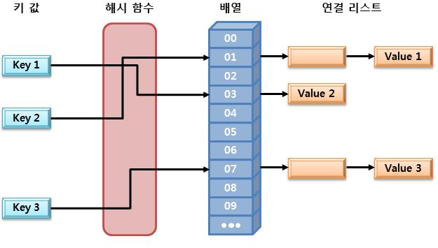
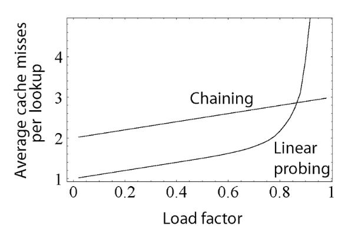

# 자료구조1(스택, 큐, 덱, 문자열, 해시)

### 관련 문제들
✅
| 링크 | 수민 | 새음  |
|--|--|--|
| [https://www.acmicpc.net/problem/10828](https://www.acmicpc.net/problem/10828)|✅||
| [https://www.acmicpc.net/problem/9012](https://www.acmicpc.net/problem/9012)|✅||
| [https://www.acmicpc.net/problem/10799](https://www.acmicpc.net/problem/10799)|✅||
| [https://www.acmicpc.net/problem/10845](https://www.acmicpc.net/problem/10845)|✅||
| [https://www.acmicpc.net/problem/10866](https://www.acmicpc.net/problem/10866)|✅||
| [https://www.acmicpc.net/problem/10808](https://www.acmicpc.net/problem/10808)|✅||
| [https://www.acmicpc.net/problem/10809](https://www.acmicpc.net/problem/10809)|✅||
| [https://www.acmicpc.net/problem/10820](https://www.acmicpc.net/problem/10820)|✅||
| [https://www.acmicpc.net/problem/2743](https://www.acmicpc.net/problem/2743)|✅||
| [https://www.acmicpc.net/problem/11655](https://www.acmicpc.net/problem/11655)|||
| [https://www.acmicpc.net/problem/10824](https://www.acmicpc.net/problem/10824)|||
| [https://programmers.co.kr/learn/courses/30/lessons/42577](https://programmers.co.kr/learn/courses/30/lessons/42577)|✅||
   

 

## [issue]에 대한 정리

### issue1 : Stack이란?

 
 

### issue2 : Hash란?

**Hash**는 Key-Value 한쌍으로 구성되는데,  Hash함수를 통해 키 값(K)을 Hash값(K')으로 변환하고, 그 Hash값을 배열의 인덱스로 하여 배열에 Value 값을 저장하는 자료구조를 말한다.
> arr[A'] = Value

Hash값을 통해 해당 값에 바로 접근할 수 있는 자료구조로, 평균 시간 복잡도가 O(1)로 매우 빠르다.

#### 해시 충돌

해시충돌이란 같은 hash값을 가진 값이 여러개가 되는 경우이다. 
해시함수를 잘 짜지 않으면 발생하기 쉽다.
또한, 해시함수의 입력값은 무한하지만, 출력값의 가짓수는 유한(출력값, 즉 키가 유한하지 않다면 해시기법을 사용하는 의미가 없다.)하므로 해시 충돌은 반드시 발생한다.**(비둘기집 원리)**  

**해결 방법**
1. **Open addressing (개방주소법)**
	
	해시 충돌이 일어나면 다른 버켓에 데이터를 삽입하는 방식
	
	>	**선형 탐색(Linear Probing)** : 해시충돌 시 다음 버켓, 혹은 몇 개를 건너뛰어 데이터를 삽입한다.
	> **제곱 탐색(Quadratic Probing)**: 해시충돌 시 제곱만큼 건너뛴 버켓에 데이터를 삽입(1,4,9,16..)
	> **이중 해시(Double Hashing)** : 해시충돌 시 다른 해시함수를 한 번 더 적용한 결과를 이용함.  

2.  **Chaining**
	버킷 내에서 연결리스트로 데이터를 연결
	

### issue2 : Hash란?

